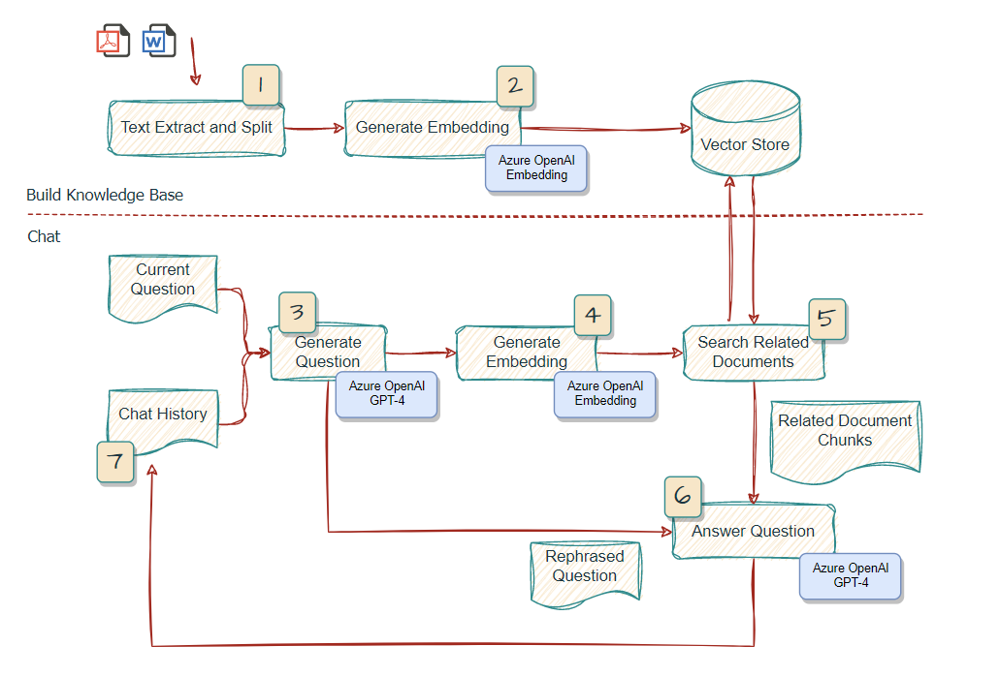

## Architecture



## Installation
1. Install the required Python packages:

Create virtual environment:

```bash
python3 -m venv .venv
source .venv/bin/activate
```

2. Install depenancies:

```bash
pip install -r requirements.txt
```

### Azure OpenAI Services

1. Obtain your Azure OpenAI API key, Endpoint and Deployment Name from the [Azure Portal](https://portal.azure.com/).
2. Create `.env` in the root dir and set the environment variables in the file:

```
OPENAI_API_BASE=https://your-endpoint.openai.azure.com
OPENAI_API_KEY=your-key-here
OPENAI_GPT_DEPLOYMENT_NAME=your-gpt-deployment-name
OPENAI_EMBEDDING_DEPLOYMENT_NAME=your-embedding-deployment-name
```

## Usage: CLI

The CLI application is built to support both `ingest` and `chat` commands. Python library `typer` is used to build the command line interface.

### **Ingest**

This command would take the documents as input, split the texts, generate the embeddings and store in a vector store `FAISS`. The vector store would be store locally for later used for chat.
    
```bash
$ python chat_cli.py ingest --path "./data/source_documents/super.pdf" --name super
```
Note that the path should be enclosed with double quotes to avoid shell expansion.

### **Chat**

This command would start a interactive chat, with documents as a external knowledge base in a vector store. You could choose which knowledge base to load for chat. 

A sample documents about SuperTech West Midland has been provided in the [data/source_document](data/source_documents) 
The previous command should ingest this sample pdf and stored in the vector store [data/vector_store](data/vector_store). You could run the following command to start a chat with the documents:

```bash
$ python chat_cli.py chat
```

Or you could specify the vector store to load for chat:

```bash
$ python chat_cli.py chat --name super
```


## Reference

`Langchain` is leveraged to quickly build a workflow interacting with Azure GPT-4. `ConversationalRetrievalChain` is used in this particular use case to support chat history. You may refer to this [link](https://python.langchain.com/en/latest/modules/chains/index_examples/chat_vector_db.html) for more detail.

For `chaintype`, by default `stuff` is used. For more detail, please refer to this [link](https://docs.langchain.com/docs/components/chains/index_related_chains)

## Credits

- The LangChain usage is inspired by [gpt4-pdf-chatbot-langchain](https://github.com/mayooear/gpt4-pdf-chatbot-langchain)
- The integration of langchain streaming and Stremlit is inspired by [Examples from Streamlit](https://github.com/streamlit/llm-examples)
- The processing of documents is inspired by [OpenAIEnterpriseChatBotAndQA](https://github.com/RicZhou-MS/OpenAIEnterpriseChatBotAndQA)

## License

`chat-with-your-doc` is released under the [MIT License](LICENSE). See the `LICENSE` file for more details.
